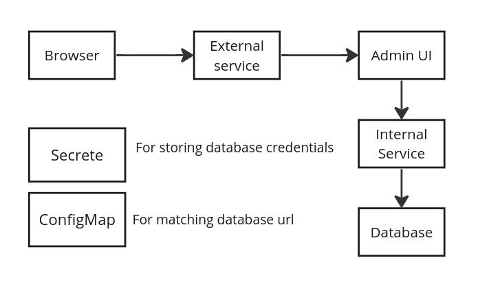
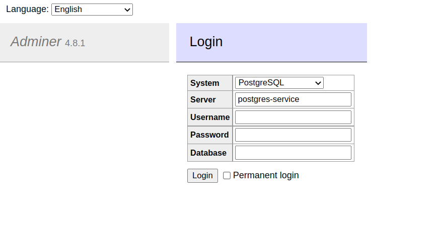

# k8s-demo

Following Nana's tutorial, 
[Kubernetes Tutorial for Beginners [FULL COURSE in 4 Hours]](https://www.youtube.com/watch?v=X48VuDVv0do&t=4888s), 
and deployed a [PostgreSQL](https://www.postgreql.org/) database with an admin UI 
([Adminer](https://www.adminer.org/)) using k8s.





## Running the cluster locally
- Setup Minikube
- Setup secret.
```
$ kubectl apply -f postgres-secret.yml
```
- Setup PostgreSQL database and an internal service.
```
$ kubectl apply -f postgres.yml
```
- Setup config map for internal service matching.
```
$ kubectl apply -f postgres-configmap.yml
```
- Setup Adminer and an external service.
```
$ kubectl apply -f adminer.yml
```
- Minikube provide external IP address for Adminer.
```
$ minikube service adminer-service
```
- Open your browser and access Adminer (username: `username`, password: `password`).
